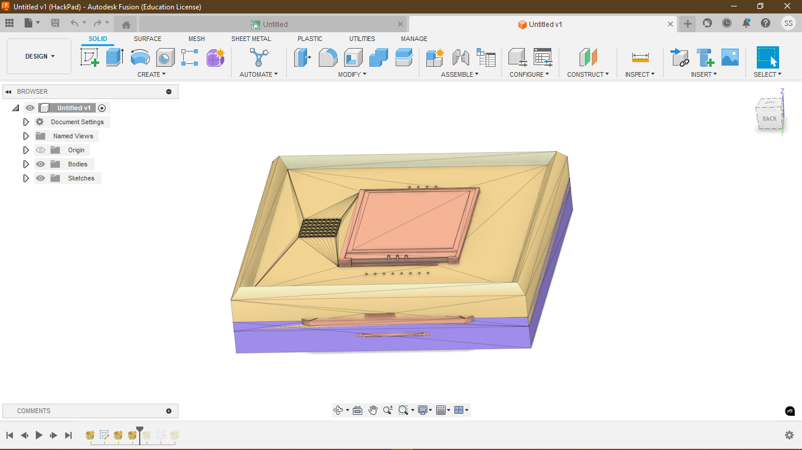
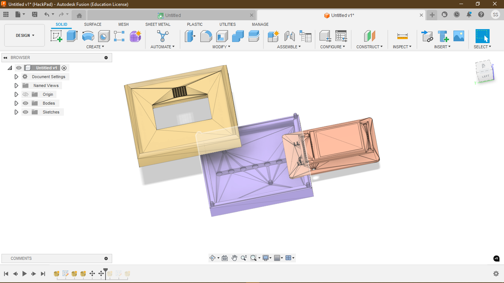
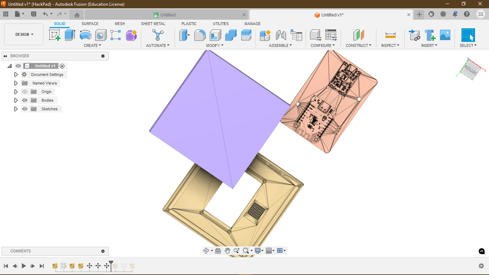
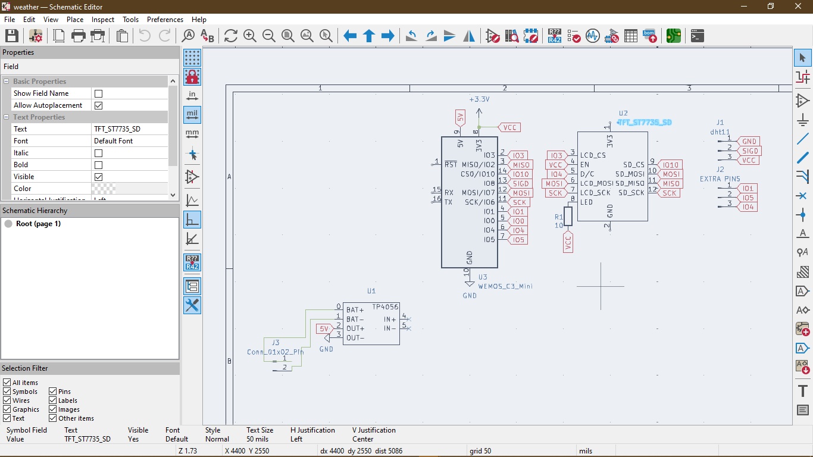
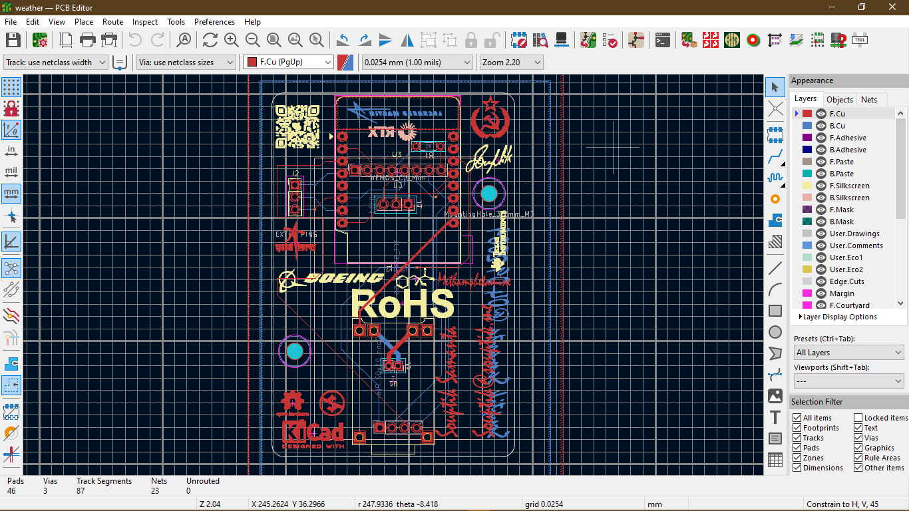
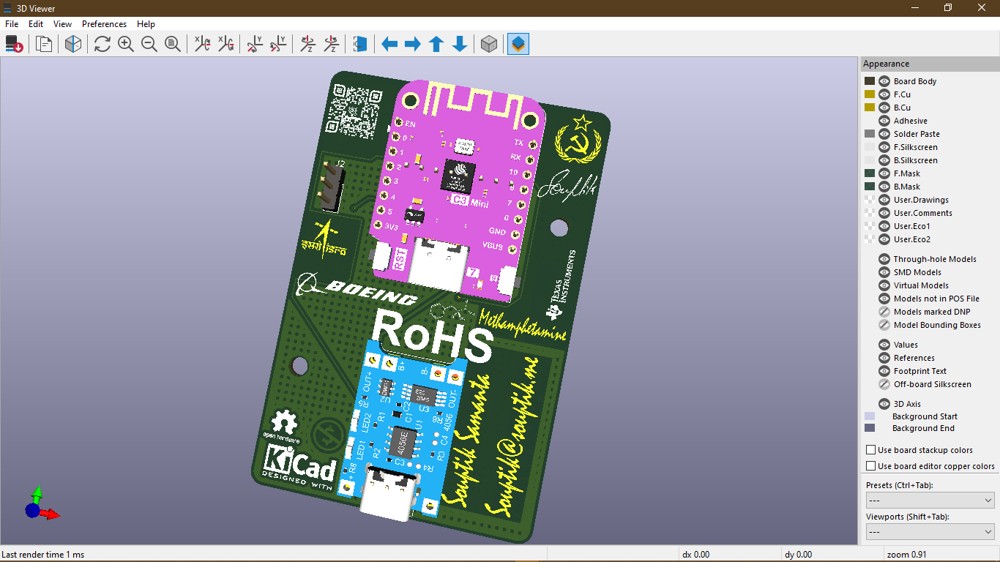

# ZephyrStation

## Overview

**ZephyrStation** is a DIY weather station designed to fetch and display real-time weather data using the OpenWeatherMap API. Built around a custom PCB featuring a Wemos C3 microcontroller, it includes a 1.8-inch TFT display and expandable pin headers for hardware hacking. ZephyrStation is ideal for tinkerers, developers, and anyone looking to explore IoT applications.

## Features

- **API-Based Weather Data**
  - Retrieves temperature, humidity, and other weather details via OpenWeatherMap.
- **Custom PCB Design**
  - Includes a Wemos C3 microcontroller with organized pin headers for expandability.
- **Display**
  - Integrated 1.8-inch TFT screen for real-time data visualization.
- **Wi-Fi Enabled**
  - Uses the Wemos C3’s Wi-Fi capabilities for fetching API data.
- **Hackable Design**
  - Expandable pin headers allow users to add custom sensors or peripherals.

## Components

- **Main Components**
  - Wemos C3 microcontroller for processing and connectivity.
  - 1.8-inch TFT display with SD card slot for data visualization.
  - Custom-designed PCB with accessible pin headers.
- **Optional Components**
  - Additional sensors or modules connected via pin headers.
- **Power Supply**
  - 3.3V or 5V input power source.

## License 

This project is open-source and licensed under the MIT License.
## Top view

## Seprerate view

## Misc view

## BOM 
-- Wesmos c3 
-- tp4056 
-- TFT_ST7735_SD
-- dht 11
-- sd card 

## Schematic 

## PCB

## 3D VIEW

## BOM
**From Hq**
-- 10 WS2812B at .04$/led so 40 cents 
 **Provided by dari // alex:**

-- 1x WeMos S2 Mini (as a cheaper replacement for the S2) WITHOUT FEMALE HEADERS
-- 1x ST7735 1.8" LCD display WITHOUT FEMALE HEADERS. Male headers soldered!
-- 1x 3D printed case 

**From LCSC**
-- headers 
-- screw 
-- DHT11
-- Antena 
---
